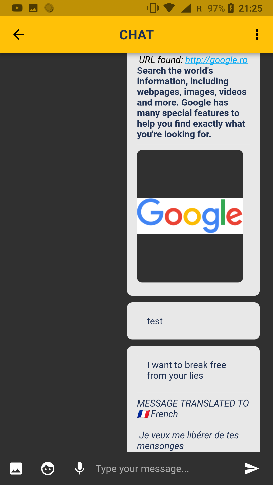
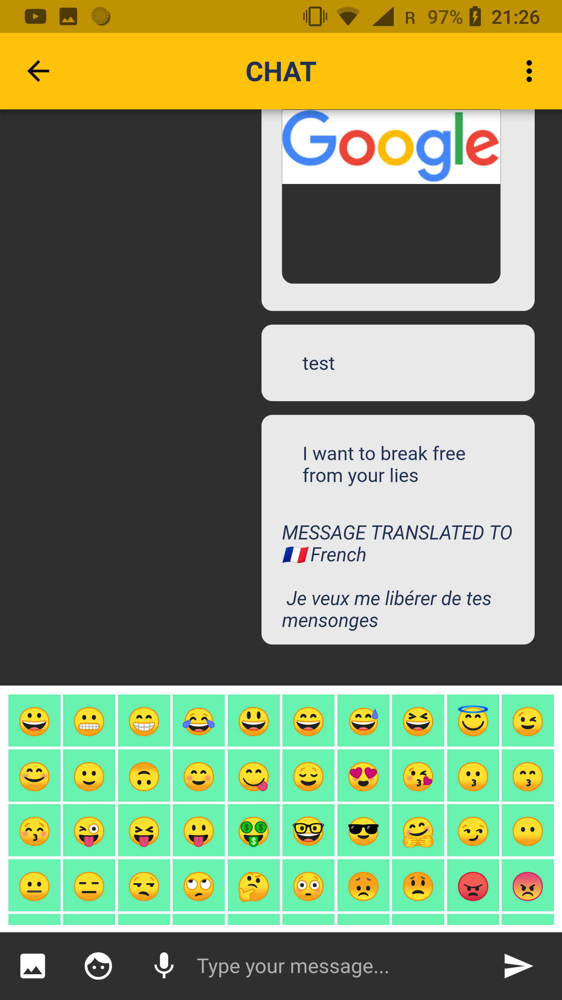
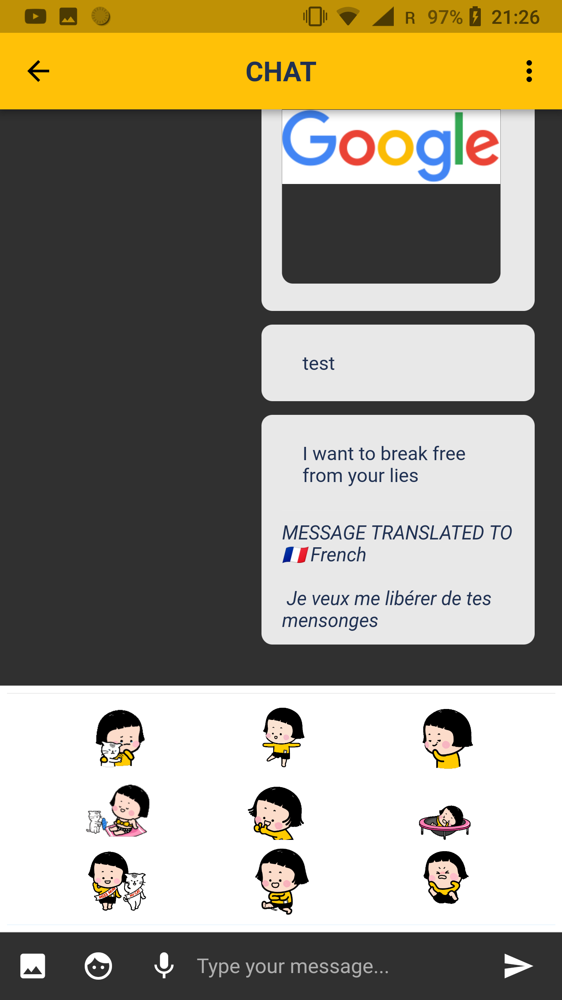
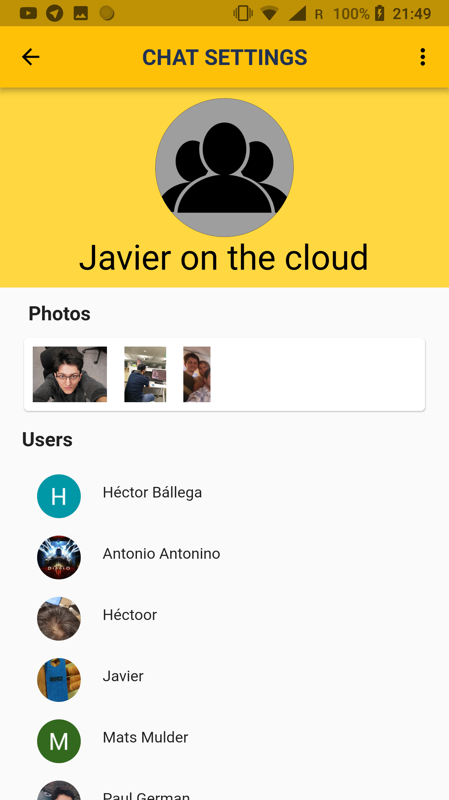
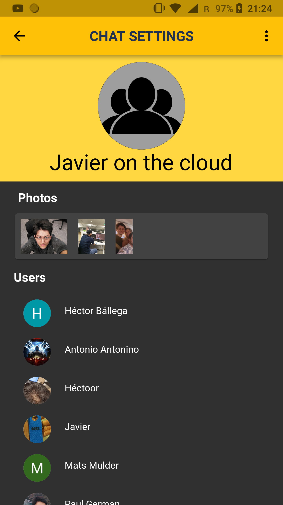
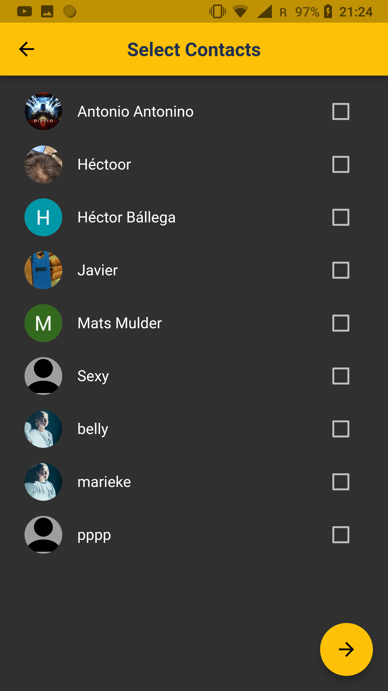

# Chat Demo
This is a chat application implemented in [__Flutter__](https://flutter.io/) and [__Firebase__](https://firebase.google.com). It is a fork of [duytq94 flutter chat](https://github.com/duytq94/flutter-chat-demo) with structural changes. Originally, this application was an university project for the course __Mobile Cloud Computing__ at [__Aalto University__](https://www.aalto.fi/).

## Description:
We developed the required chatting application using the very recent cross-platform development tool [__Flutter__](https://flutter.io/). Flutter is a tool developed by Google that makes use of the Dart language. Very recently, and in the middle of our developement process, official version 1.0 has been released, making it actually out of the beta phase.

The app fulfills all the required basic functionalities, as well as implements some of the extra ones.

Such extra functionalities are:
- _Voice-to-text Input_: using the [Google Speech-to-Text API](https://cloud.google.com/speech-to-text/), a user can record a voice message, which is then converted to text and sent as text message;
- _Link Preview_: using the web REST service [LinkPreview](https://www.linkpreview.net/), whenever a URL is detected in a text message (only the first one), metadata information is retrieved from the web service and shown in the UI to all the users receiving the message;

- _Emoticons Library_: users can send both static and dynamic emoticons (as also shown in the screenshots below) as content of a message;

- _Text Processing_: using the [Google Cloud Translation API](https://cloud.google.com/translate/), messages are translated from whatever language they are written into a language set by the user. Translation can happen __on-demand__, by long pressing on a message, or __automatically__ so that the translated content is shown directly next to the message in the original language. The settings regarding the destination language as well as the translation mode (on-demand or automatic) can be changed from the settings screen.

- _Themes Support_: users can choose between a light theme (chosen by default) and a dark theme.

## Repository structure

The repository contains the following files/folders:

- _README.md_: this file;
- _deploy.sh_: basic bash script for a quick installation of the requirements.
- _backend_: contains firebase project.
- _frontend_: contains flutter project.

## Supported platforms

- In __Android__ is completally operative.
- In __IOS__ is not currently working. There is needed some configuration to make it work in this _platform_.

## How to run the deployment script

In order to run the deployment script, which handles all the necessary operations in order to deploy the cloud functions and build and run the Android application on a target Android device, first thing needed is to move into the root of the project.

`cd application_folder/`

Then, executable permissions might not be set and need to be given to the script in order to properly interact with the filesystem.

`chmod +x deploy.sh`

The last step is as simple as running the deployment script.

`./deploy.sh`

## Screenshots:

